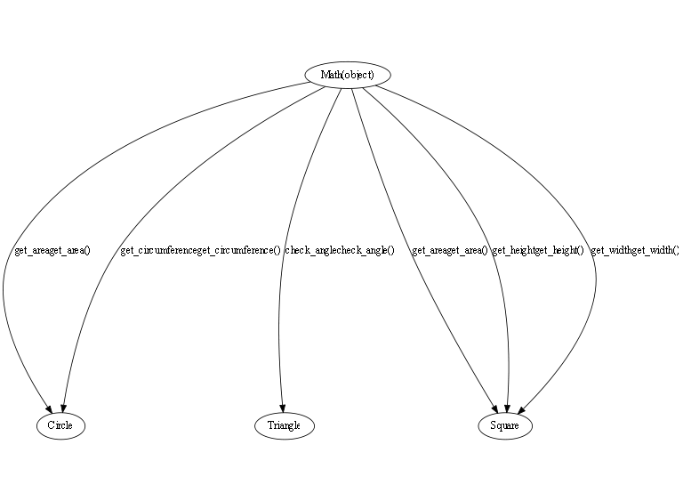

## Introduction
TODO: Describe the about the project 


## Requirements
These are the requirments needs to be install in order to execute this project: 

```information need to execute```


## API Reference
#### class2

>**method1**

#### class1

>**method3**
>**method2**
>**method1**


## Dependency graph


## Contributor
get recent participant of the projects


## License
get license of the project


